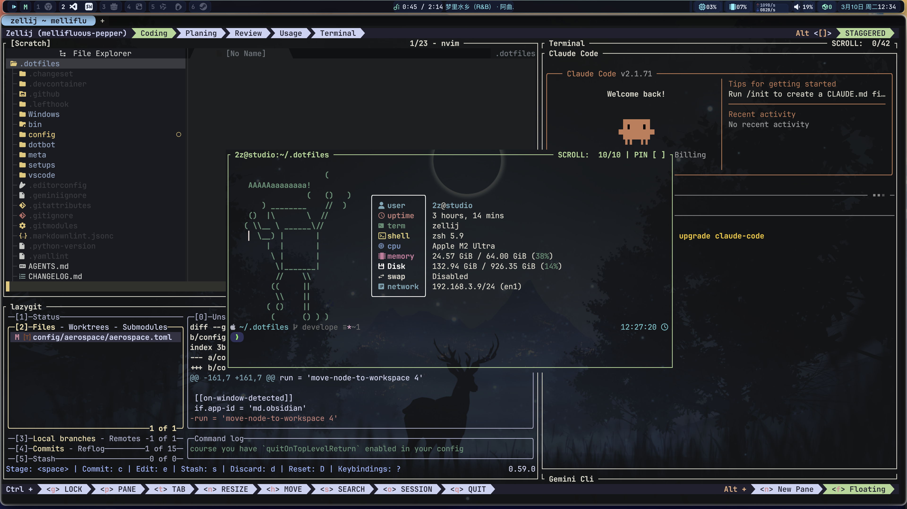

# 🛠️ dotfiles

My personal dotfiles, meticulously managed with **Dotbot** and powered by **just**. This repository is designed to be modular, cross-platform, and highly automated, supporting macOS, Linux (Ubuntu/WSL2), and Windows.

---

[](https://github.com/souo/dotfiles/actions/workflows/ci.yml)



## 🚀 Quick Start

### 1. Prerequisites

- **Git** (for cloning)
- **Python 3** (for Dotbot)
- **[mise](https://mise.jdx.dev/)** (highly recommended for managing `just`, `node`, `python`, etc.)
- **[just](https://github.com/casey/just)** (task runner)
- **zsh** (preferred shell)

### 2. Installation

```bash
git clone --recursive https://github.com/yourusername/dotfiles.git ~/.dotfiles
cd ~/.dotfiles

# If using mise, it will automatically install 'just'
# Otherwise, ensure 'just' is in your PATH
just bootstrap
```

### 3. Deploy Profiles

Deploy environment-specific configurations using the unified task runner:

```bash
# macOS
just install mac

# Ubuntu / WSL 2
just install ubuntu
just install wsl

# Windows
just install windows
```

> **Pro Tip**: Use `just dry-run <profile>` to preview changes. Run `just standalone nvim` to install only specific configurations.

---

## ✨ Features & Enhancements

### 🔍 FZF Deep Integration

Optimized fuzzy finding with real-time previews (using `bat` and `eza`):

- **`f`**: Fuzzy file search with syntax-highlighted preview.
- **`fz`**: Fuzzy directory jump (integrated with `zoxide`).
- **`fk`**: Interactive process killer with detailed info.
- **`dot`**: Quickly search and edit your dotfiles.

### 🍱 Zellij "Vibe" Layout

A pre-configured development environment for Zellij:

- **`vibe`**: Launch a multi-tab workspace (Coding, Planning, Review, Terminal).
- **Auto-tools**: Automatically opens `nvim`, `lazygit`, and AI helpers (`gemini`, `claude`) in a single organized view.

### 📂 Yazi "CD on Quit"

Enhanced [Yazi](https://yazi-rs.github.io/) integration:

- **`y`**: Launch Yazi. When you quit with `q`, your shell automatically `cd`s to the last directory you were browsing.

### 🪐 Atuin Magical History

[Atuin](https://github.com/atuinsh/atuin) replaces your shell history with a SQLite database for enhanced search and sync:

- **Full-text search**: Filter history by any keyword
- **Directory aware**: Only show commands run in the current directory (toggle with `Ctrl+D`)
- **Filter mode**: Toggle between global, directory, and session history (toggle with `Ctrl+R`)
- **Time sync**: History synced across all your machines
- **Fuzzy search**: Built-in fuzzy matching for finding that command you ran last week

**Tips:**

- Use `Ctrl+R` to open Atuin's interactive search UI
- Configure sync behavior in `~/.config/atuin/config.toml`
- Use `atuin import auto` to import existing shell history on first setup

### 🎮 Neovim (rafi/vim-config)

A modern Neovim configuration powered by [rafi/vim-config](https://github.com/rafi/vim-config):

- **LSP**: Full language server protocol support for code completion, diagnostics, and refactoring
- **Treesitter**: Syntax highlighting and code understanding
- **Telescope**: Fuzzy finding for files, grep, buffers, and git
- **Neo-tree**: Modern file explorer
- **Bufferline**: Tab-like buffer management
- **Gitsigns**: Inline git diff display
- **Auto-pairs**: Automatic bracket/quote closing

**Manage Neovim:**

```bash
just nvim-reinstall   # Reinstall from scratch (backup old config)
just nvim-sync        # Sync all plugins
just nvim-update      # Update vim-config core
just nvim-config      # Open plugin configuration
just nvim-health      # Check health status
```

**Key Bindings:**

- `<leader>ff` - Find files
- `<leader>fg` - Live grep
- `<leader>fb` - List buffers
- `<S-h>/<S-l>` - Previous/Next buffer
- `<S-q>` - Close buffer

### ⚡ Unified Configuration

The deployment scripts (`install-profile.sh` and `install-standalone.sh`) have been optimized to merge all YAML fragments into a single execution, making the installation **up to 10x faster** than traditional sequential Dotbot runs.

---

## 🎨 UI & Customization (macOS)

### 🚀 AeroSpace + SketchyBar

A tiling window management system combined with a highly dynamic status bar:

- **AeroSpace**: i3-like tiling window management for macOS.
- **SketchyBar**: A Lua-configured bar that syncs with AeroSpace workspaces.
- **Custom App Icons**: Automated system to build `sketchybar-app-font` from custom SVGs. Add an SVG to `assets/svgs/` and run `setup.sh` to update your icons.
- **JankyBorders**: Visual window borders to identify the active pane.

---

## 🛡️ Security & Privacy

To keep your sensitive information safe and secure, this repository uses **SOPS + Age** for GitOps-style encrypted secret management:

1. **`~/.dotfiles/config/zsh/common/.env.secret.sops`**: Encrypted API keys and tokens safely tracked by Git.
   - Run `just secret-edit` to securely modify secrets.
   - Run `just secret-sync` to decrypt them locally to `~/.zsh_secret`.
2. **`~/.localrc`**: For machine-specific environment overrides or private aliases.
3. **`~/.gitconfig.local`**: For Git user information (`name`, `email`).
4. **VSCode Local Settings**: Machine-specific settings in `settings.local.json`.

---

## 🏗️ Modular Architecture

This repository uses a **Fragmented Dotbot System** to scale cleanly:

```text
├── meta/
│   ├── configs/   # Isolated YAML fragments (e.g., nvim.yaml, zsh.yaml)
│   └── profiles/  # OS profiles combining fragments (mac, ubuntu, wsl)
├── config/        # Source dotfiles symlinked to your system
├── bin/           # Custom CLI utilities
└── setups/        # Bootstrap OS-level dependency installers
```

- **`meta/configs/`**: Standalone YAML fragments for individual tools (e.g., `nvim.yaml`, `zsh.yaml`).
- **`meta/profiles/`**: Environment definitions that list which fragments to apply.
- **`justfile`**: The cross-platform command center for all maintenance tasks.

---

## 🧰 Tech Stack

| Category | Tool | Description |
| :--- | :--- | :--- |
| **Task Runner** | [just](https://github.com/casey/just) | Cross-platform command runner for all dotfile tasks. |
| **Shell** | [Zsh](https://www.zsh.org/) + [Antidote](https://getantidote.github.io/) | Static plugin management with `zsh-defer` for zero-delay startup. |
| **Launcher** | [Raycast](https://www.raycast.com/) | Advanced launcher with script commands and deep integrations. |
| **Prompt** | [Oh My Posh](https://ohmyposh.dev/) | Cross-shell theme engine for consistent aesthetics. |
| **Editor** | [Neovim](https://neovim.io/) + [rafi/vim-config](https://github.com/rafi/vim-config) | Modern Lua-based Neovim distribution with LSP, autocomplete, and file explorer. |
| **Terminal** | [WezTerm](https://wezfurlong.org/wezterm/) + [Zellij](https://zellij.dev/) | GPU terminal & terminal workspace with "Vibe" layouts. |
| **Window Mgmt** | [Aerospace](https://github.com/nikitabobko/AeroSpace) + [Borders](https://github.com/FelixKratz/JankyBorders) | (macOS) Tiling window management with visible borders. |
| **Status Bar** | [SketchyBar](https://felixkratz.github.io/SketchyBar/) | (macOS) Highly customizable Lua-based status bar. |
| **File Manager** | [Yazi](https://yazi-rs.github.io/) | Blazing fast Rust-based terminal file manager. |
| **Navigation** | [fzf](https://github.com/junegunn/fzf) + [zoxide](https://github.com/ajeetdsouza/zoxide) + [Atuin](https://github.com/atuinsh/atuin) | Fuzzy finder, smarter `cd`, and magical shell history. |
| **Git Tooling** | [Lazygit](https://github.com/jesseduffield/lazygit) + `gh` + `delta` + `difftastic` | TUI for Git, GitHub CLI, and enhanced diffing. |
| **Docker Tooling** | [Lazydocker](https://github.com/jesseduffield/lazydocker) | TUI for managing Docker containers. |
| **Modern CLI** | `eza`, `bat`, `rg`, `fd`, `jaq`, `fastfetch` | Better versions of core Unix utilities. |
| **Dev Tooling** | `uv`, [mise](https://mise.jdx.dev/), `rustup`, `bun` | Toolchain management for Python, Node, Java, Rust, and JS. |
| **Maintenance** | [Topgrade](https://github.com/topgrade-rs/topgrade) | System-wide update manager. |
| **Customizer** | [Karabiner](https://karabiner-elements.pqrs.org/) + [IdeaVim](https://github.com/JetBrains/ideavim) | Keyboard customization and Vim emulation for IDEs. |

---

## 🛠️ Development & Quality

- **Git Hooks**: [Lefthook](https://github.com/evilmartians/lefthook) manages pre-commit checks.
- **Commits**: `just commit` for conventional commits.
- **Versioning**:
  - `just change`: Create a new changeset.
  - `just version`: Bump version and update `CHANGELOG.md`.
- **Maintenance**: `just update` to sync all submodules and tools.

---
